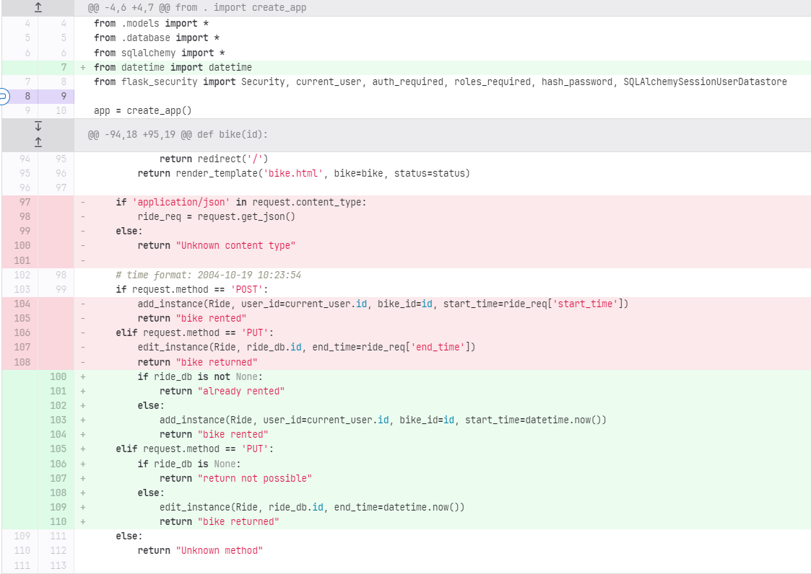
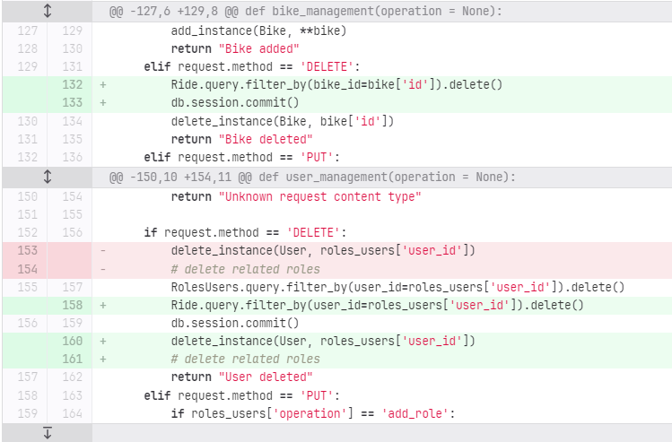

# Debugging
Debugging is the process of identifying and resolving errors or bugs in a computer program. It involves analyzing the program's code, looking for the root cause of the problem, and making changes to the code to fix the issue. Debugging can be done using a variety of tools and techniques, such as breakpoints, step-by-step execution, and print statements. Debugging can be a time-consuming process, but it is essential for ensuring that a program is functioning correctly and efficiently.

Also during the BikeRental project some bugs occurred.

## Bug1: Lending time could be manipulated by changing the time of the device
First, the start and end time of the lending time was passed via the HTTP request POST and PUT. However, this could be manipulated, which is why the python libary "datetime" now determines the start and end time in the backend and writes it to the database (see picture below).

## Bug2: Users and bikes could not be deleted if a ride was still open
If a user has rented a bike but has not yet returned it, the user as well as the bike could not be deleted from the database. To solve the problem a database query was added to the HTTP request DELETE, which deletes all rides of the affected bike or user (see picture below).

